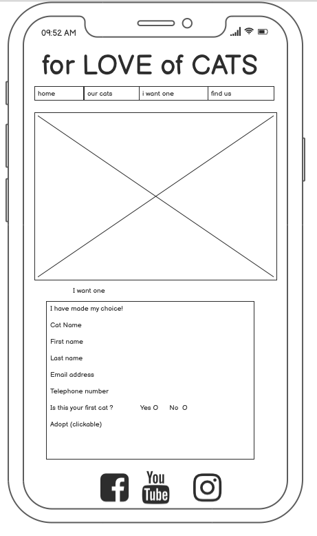

# for LOVE of CATS (fLoC)

[for LOVE of CATS](https://morpheus-23.github.io/cat-love/) is a website for people who want to adopt a rescued cat. It enables people to browse through a list of cats that are available for adoption and gives information about each cat. It also allows people to send their contact information along with the name of the cat they are interested in.

## User Experience (UX)

### User stories

- First Time User
    - As a First Time User, I want the home page to entice me to indulge my curiosity about adopting a rescued cat.
    - As a First Time User, I want each page to indicate the navigation possibilities of the site.
    - As a First Time User, I want to find the website easy to navigate and move between the pages of the site.
    - As a First Time User, I want the site to provide information about the background/backstory of the site owner.
    - As a First Time User, I want to be able to browse through the list of available cats and read about their characteristics and special needs, if any
    - As a First Time User, I want to be able to apply for the adoption of a cat.
    - As a First Time User, I want to easily find the contact details of the site owner.

- Returning User
    - As a Returning User, I want to see new cats available for adoption.
    - As a Returning User, I want to read about success stories of adopted cats, whether rescued or rehomed.
    - As a Returning User, I want to read about collaborations with other rescue organisations, thus growing the rescue and rehoming efforts.

### Strategy

 - The main aim and focus of fLoC are to establish a reputation as a reputable/trustworthy rescuer that constantly rescues feral and/or homeless cats and find safe and loving homes where the cats can happily live out the remainder of their 9 lives.
 - For fLoC it is of utmost importance to:
    - rescue cats living on the streets / from vulnerable situations;
    - rehabilitate/socialise the cats before opening them up to adoption;
    - find good and loving homes for the adoptable cats;
    - find foster homes to help rehabilitate/socialise cats/kittens until they are ready to be adopted;
    - find other rescuers, whether individuals and/or organisations to collaborate efforts to enable more cats to be rescued from the streets / undesirable situations;
    - create an online presence to enable other rescuers, potential foster homes, potential adopters to make contact with fLoC to help as many cats as possible;
- For a further release:
    - Once fLoC is well established and growing in efforts, the intention is to attract donors such as companies producing and/or selling cat food, treats, accessories, medical supplies and supplements. 
    - When fLoC has a well-established following, it may consider endorsing products for cats, provided that the production and distribution of said products are in line with the aim of fLoC, thus no harm to cats in any way or form.  No harm to any animal during the product research, product development, production, or distribution of any products will be tolerated/endorsed.

### Scope

- Release 1: the functional specifications
    - For the launch of the website the following critical pages should form part of the first release:
        - Our Story page, providing basic information about fLoC and the purpose of the website;
        - Our Cats page, introducing the cats currently available for adoption;
        - Adoption request page, enabling potential adopters to apply for the adoption of a specifically selected cat, from the Our Cats page;
        - Find Us page, enabling potential adopters, collaborators, and the general public who may have information about cats needing rescue to make contact with fLoC.

- Release 2: future specifications intended for release following the initial website launch:
    - For the next release, the following pages should be added:
        - Rescue success stories, making provision for messages and photographs to be submitted to fLoC and published by fLoC following administrator approval and to motivate potential adoptees or persons needing to surrender their cat to contact fLoC;

- Release 3:
    - For the following release, the following pages should be added:
        - Emergency contact page, setting out contact details of rescuers and/or organisations that have agreed to collaborate efforts and are willing to stand in if/when fLoC cannot be reached in case of an emergency rescue;
        - Volunteer application page, providing for potential volunteers to submit a photograph, a cv and a cover letter.

- Future releases:
    - For future releases, the following pages should be considered/developed;
        - Video footage, photographs, and stories documenting rescue efforts with or without collaborations, provided the required consents and legal waivers have been obtained from any and all participants;
        - Donation / sponsor requests and/or acknowledgements;
        - Product endorsement possibilities; 
        - Stories from rescuers setting out the challenges in rescuing and finding suitable homes for cats;
        - FAQ - frequently asked questions addressing various questions and concerns as obtained from market research conducted;

### Structure

- The purpose of the website is to attract potential cat adopters, thus helping feral and/or homeless cats find good homes. 
- The website is kept fairly simple and very easy to navigate, ensuring a positive user experience.  The structure was developed with that in mind.
- The initial website consists of four pages:
    - Our Story
    - Our Cats
    - Adoption request
    - Find us
- The initial pages all have the following structure:
    - Logo: All the pages have a clickable logo which provides for easy navigation back to the home page;
    - Navigation bar: Located on each page enabling the user to easily locate it and navigate the site;
    - Hero Images: Each page has a different hero image that uses a zoom animation and each page has a colour theme, which theme matches the clickable navigation bar item;
    - Footer: Pinned at the bottom of each page and contains social media links for easy sharing of fLoC efforts and experiences.

### Skeleton

- Considering the strategy, scope and structure the following wireframes were created:

    - Desktop:

        - Our Story 

            

        - Our Cats 

            

        - I want one 

            

        - Find us 

            

    - Mobile:

        - Our Story

            

        - Our Cats

            

        - I want one

            

        - Find us

            

### Surface

- The clickable logo and navigation bar is consistently located on each page, allowing an intuitive user experience
- Each page has a unique colour theme and the navigation hover and active page colour matches the target page's theme
- The selected navigation menu item background colour indicates which page is displayed
- The footer is pinned at the bottom of each page, enabling easy access to social media links for fast sharing or communication

- Screenshots reflecting the following pages:

    - For desktop:

        - Home page

            

        - Our Cats 

            

        - I want one 

            

        - Find us

            

    - For tablet (both horisontal and vertical views):

        - Home page 

              
            and  
            

        - Our Cats 

              
            and  
             

        - I want one 

              
            and  
             

        - Find us 

              
            and  
            

    - For mobile:

        - Home page

            

        - Our Cats 

            

        - I want one 

            

        - Find us

            

## Features

### Existing Features

#### Common Page features

- Logo
    - The logo is clickable and provides an easy way to navigate back to the home page
    - It is consistently located on each page allowing the user to easily find it
  
- Navigation Bar
    - Consistently located on each page allowing an intuitive user experience
    - Provides links to the Home, Our Cats, Adoption and Find Us pages
    - The active menu item is highlighted and themed according to it's target page

- Hero images
    - Each page contains a different hero image
    - Each hero image has a colour theme that matches the navigation bar item and the cover text
    - The hero images uses a zoom animation to draw the user into the page

- Footer
    - Pinned at the bottom of the page
    - Contains social media links for fast sharing or communication
    
#### Page specific features

- Our Story page
    - Provides information about who fLoC is, what they do and why they do it
    
- Our Cats page
    - Allows the user to see a list of cats available for adoption
    - Shows a photo, the cat's name and other useful information about cat
    - Updated when new cats become available and existing cats are adopted

- Adoption request page
    - Allows the user to submit a request to adopt a specific cat
    - The user supplies all required fields allowing fLoC to establish contact and start the process
    
- Find Us page
    - Provides operating hours, adress and contact information

## Testing

### Layout

* Page title remains constant for all pages
* Logo location always remains constant
* Navigation bar location always remains constant
* Footer remains pinned to bottom of browser window
* Content pages header location remains constant on each page

### Navigation

* Clicking the logo navigates to landing page in the same tab
* Clicking the navigation menu items navigates to the correct site page in the same tab
* Clicking the social media links navigate to the correct external social media site in a new tab

### Form

* Input form validates required input fields and guides the user correctly to remedy the problem
* Submit button submits to the CI backend and displays information in a new tab

### UX

* Each page has a unique colour theme and the navigation hover and active page colour matches the target page's theme
* The selected navigation menu item background colour indicates which page is displayed

### Testing User Stories from the UX Section

- First Time User
    - As a First Time User, I want the home page to entice me to indulge my curiosity about adopting a rescued cat.
        * Each page has a zooming hero image that holds the attention of the user
        * Each page has a colour theme that is consistent for that page

    - As a First Time User, I want each page to indicate the navigation possibilities of the site.
        * The Home page displays the navigation bar at the top of the page
        * The Our Cats page displays the navigation bar at the top of the page
        * The I Want One page displays the navigation bar at the top of the page
        * The Find Us page displays the navigation bar at the top of the page

    - As a First Time User, I want to find the website easy to navigate and move between the pages of the site.
        * The navigation buttons highlight when the mouse pointer hovers over them
        * The behaviour of the navigation buttons is consistent across all pages

    - As a First Time User, I want the site to provide information about the background/backstory of the site owner.
        * The Home page contains the Our Story section
        * The Our Story section contains relevant subsections

    - As a First Time User, I want to be able to browse through the list of available cats and read about their characteristics and special needs, if any.
        * The Our Cats page displays a list of available cats
        * Each item in the list displays the following information:
            - Picture of the cat
            - Age
            - Gender
            - Neutered
            - Personality
            - Special needs (only if applicable)

    - As a First Time User, I want to be able to apply for the adoption of a cat.
        * The I Want One page displays the adoption form
        * On the adoption form:
            - The Cat Name is a required field
            - The First Name is a required field
            - The Last Name is a required field
            - The Email Address is a required field
            - The Email Address format is validated
            - The Telephone Number is a required field
            - The 'Is this your first cat' field defaults to Yes
            - The Adopt button validates the user input based on these rules
            - The Adopt button submits the form after validation 

    - As a First Time User, I want to easily find the contact details of the site owner.
        * The Find Us page shows the Office hours
        * The Find Us page shows the address information
        * The Find Us page shows the Contact Us information

- Returning User
    - As a Returning User, I want to see new cats available for adoption.
        * Not implemented yet. This will be part of a future release.
    - As a Returning User, I want to read about success stories of adopted cats, whether rescued or rehomed.
        * Not implemented yet. This will be part of a future release.
    - As a Returning User, I want to read about collaborations with other rescue organisations, thus growing the rescue and rehoming efforts.
        * Not implemented yet. This will be part of a future release.

### Validator testing

- HTML
    - No html errors were returned for all four pages when passing through the official [W3C validator](https://validator.w3.org/nu/?doc=https%3A%2F%2Fcode-institute-org.github.io%2Flove-running-2.0%2Findex.html)

- CSS
    - One validation failure in the styles.css file reported by [(Jigsaw) validator](https://jigsaw.w3.org/css-validator/validator?uri=https%3A%2F%2Fvalidator.w3.org%2Fnu%2F%3Fdoc%3Dhttps%253A%252F%252Fcode-institute-org.github.io%252Flove-running-2.0%252Findex.html&profile=css3svg&usermedium=all&warning=1&vextwarning=&lang=en#css)
    - This issue will be fixed in the next release

- Google Chrome Lighthouse

### Unfixed Bugs

* See Validator testing error - Fixed in the next release

## Deployment

### GitHub Pages

- The site is deployed to GitHub pages. The steps to deploy were as follows:
    - Log into GitHub and locate the fLoC GitHub repository, navigate to the Settings tab and select the Pages 
    - From the source section drop-down menu, select the Master Branch
- The live link can be found here - [https://morpheus-23.github.io/cat-love/](https://morpheus-23.github.io/cat-love/)

### Making a Clone

- Log into GitHub and locate the fLoC GitHub repository
- Click on the fLoC repository
- Click on the Code button
- Choose the HTTPS option, then click on the clipboard right of the URL
- Then choose your IDE or editor of choice
- Open a respository or create a new repository 
- Open the terminal and type "git clone" and paste the URL copied above 
    git clone https://github.com/Morpheus-23/cat-love.git
- press enter and the clone will be created

## Unimplemented assessment criteria

* Completion / finalisation of layout changes for all screen sizes, specific issues with the navigation bar and hero images not being responsive accross all devices. On some screen sizes the navigation bar covers a part of the logo.

## Content

- All icons were taken from [Font Awesome](https://fontawesome.com/)
- All images were taken from [pixabay](https://pixabay.com/) and [free images](https://www.freeimages.com)
- Font and background colours were identified by [W3Schools](https://www.w3schools.com/colors/)
- Some design ideas were taken from Love Running and Coders Coffeehouse
- A lot of technical implementation information were taken from [W3Schools](www.w3schools.com)
- Some information was taken from [StackOverflow](https://stackoverflow.com/)

## Directory structure

The site content is structured as follows:

| Directory | Description |
|---|---|
| / | html files  |
| /assets | non-html content |
| /assets/css | all style sheets |
| /assets/images | images used by the website |
| /readme | images used by README.md file |
